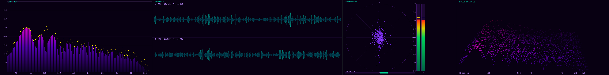
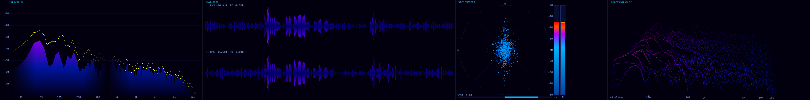
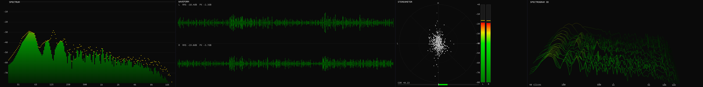
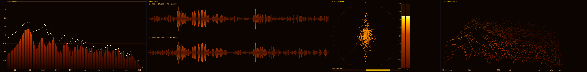
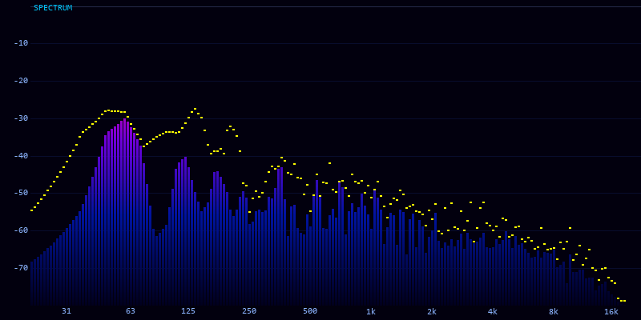
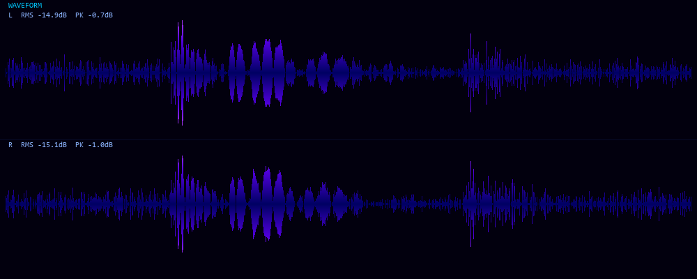
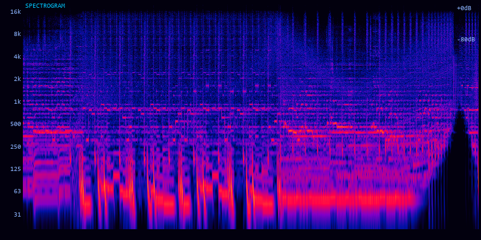
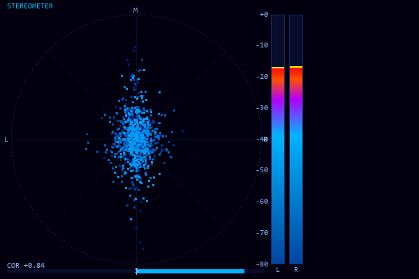
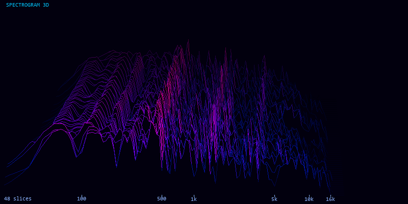

# AudioScope

A command-line audio visualization tool that renders WAV files as PNG frame sequences, ready to assemble into a video with ffmpeg.

> Inspired by the excellent [Minimeter](https://github.com/DanielRudrich/Minimeter) plugin — if you want a polished, DAW-integrated version, check out and support the original project there.

## Themes

## Neon



### Plasma



### Dark



### Ember



---

## Prerequisites

- **Python 3.12+**
- **ffmpeg** — optional, only needed to assemble frames into a video (install with `winget install ffmpeg` or see [download](https://ffmpeg.org/download.html))

## Installation

```bash
git clone https://github.com/robino16/audioscope.git
cd audioscope
pip install -e .
```

Or with [uv](https://docs.astral.sh/uv/):

```bash
uv sync
pip install -e .
```

---

## Quick start

```bash
visualize -i audio.wav -o output/frames
```

Renders `audio.wav` at 24 fps using the default `spectrum + waveform + spectrogram` layout and the `neon` theme. Numbered PNGs are written to `output/frames/`.

### Assembling into a video

**Video only:**

```bash
ffmpeg -framerate 24 -i output/frames/frame_%04d.png \
       -c:v libx264 -pix_fmt yuv420p -crf 18 output.mp4
```

**With audio muxed in:**

```bash
ffmpeg -framerate 24 -i output/frames/frame_%04d.png -i audio.wav \
       -c:v libx264 -c:a aac -pix_fmt yuv420p -crf 18 -shortest output.mp4
```

Match `-framerate` to whatever you passed to `--fps`. `-crf 18` is near-lossless; increase it for a smaller file size.

---

## Modules

Pick any combination with `-m`, comma-separated. Default: `spectrum,waveform,spectrogram`.

---

### Spectrum



FFT bar graph on a logarithmic frequency axis (20 Hz – 20 kHz). Bars are exponentially smoothed frame-to-frame, with optional peak-hold markers that hold for a configurable time before decaying.

```bash
visualize -i audio.wav -o output/frames -m spectrum
```

Key options: `--smoothing`, `--peak-hold`, `--db-range`, `--no-peaks`

---

### Waveform



Time-domain view of the trailing audio window. In stereo mode (default) it draws left and right channels stacked vertically, each with an RMS and peak readout. Use `--mono-waveform` to mix to a single trace.

```bash
visualize -i audio.wav -o output/frames -m waveform
```

Key options: `--window-secs`, `--mono-waveform`

---

### Spectrogram



Rolling waterfall display. Each column is one FFT frame; time scrolls from right to left. The frequency axis is logarithmic with labeled grid lines and a dB color legend.

```bash
visualize -i audio.wav -o output/frames -m spectrogram
```

Key options: `--db-range`, `--fft-size`

---

### Stereometer



Three panels in one:

- **Goniometer** — XY phase plot with a fading dot trail along M/S axes. A tight vertical smear means the signal is mono-compatible; a wide horizontal cloud means wide stereo.
- **Level meters** — Per-channel RMS bars with peak-hold for L and R.
- **Correlation meter** — Horizontal bar from −1 (fully out of phase) to +1 (perfectly in phase).

```bash
visualize -i audio.wav -o output/frames -m stereometer
```

---

### Spectrogram 3D



Oblique-projection waterfall. FFT slices are stacked in perspective: the most recent frame sits at the front; older slices recede and fade into the background. The number of history slices is controlled with `--n-slices`.

```bash
visualize -i audio.wav -o output/frames -m spectrogram3d
```

Key options: `--n-slices`, `--db-range`

---

## Themes

| Theme              | Character                                                                      |
| ------------------ | ------------------------------------------------------------------------------ |
| `neon` _(default)_ | Dark violet-black background; spectrum runs purple → magenta → orange → yellow |
| `plasma`           | Near-black with deep blue-to-indigo-to-yellow gradient                         |
| `dark`             | Classic monochrome black; green/amber level colors                             |
| `ember`            | Warm charcoal background; fire-style red → orange → white                      |

```bash
visualize -i audio.wav -o output/frames --theme plasma
```

---

## All options

| Flag              | Default                         | Description                                                            |
| ----------------- | ------------------------------- | ---------------------------------------------------------------------- |
| `-i / --input`    | _(required)_                    | Input WAV file                                                         |
| `-o / --output`   | _(required)_                    | Output directory for PNG frames                                        |
| `-m / --modules`  | `spectrum,waveform,spectrogram` | Comma-separated module list                                            |
| `--fps`           | `24`                            | Frames per second                                                      |
| `--height`        | `400`                           | Height of each module in pixels                                        |
| `--width`         | —                               | Force a fixed width for every module                                   |
| `--theme`         | `neon`                          | `neon` · `plasma` · `dark` · `ember`                                   |
| `--fft-size`      | `4096`                          | FFT window size (power of 2 recommended)                               |
| `--window`        | `hann`                          | Window function: `hann` · `hamming` · `blackman` · `bartlett` · `flat` |
| `--db-range`      | `80`                            | Displayed dynamic range in dB                                          |
| `--min-freq`      | `20`                            | Lowest displayed frequency (Hz)                                        |
| `--max-freq`      | `20000`                         | Highest displayed frequency (Hz)                                       |
| `--smoothing`     | `0.72`                          | Spectrum smoothing — 0 = off, 0.99 = very heavy                        |
| `--peak-hold`     | `2.0`                           | Peak marker hold time in seconds                                       |
| `--window-secs`   | `0.5`                           | Audio window fed to each module per frame                              |
| `--gain`          | `0`                             | Input gain in dB applied before processing                             |
| `--normalize`     | off                             | Normalize audio to 0 dBFS before rendering                             |
| `--no-labels`     | off                             | Hide all text labels                                                   |
| `--no-peaks`      | off                             | Hide peak-hold markers on the spectrum                                 |
| `--mono-waveform` | off                             | Mix stereo to mono in the waveform module                              |
| `--format`        | `png`                           | Output image format: `png` · `jpg`                                     |
| `--quality`       | `95`                            | JPEG quality (only with `--format jpg`)                                |
| `--separator`     | `2`                             | Pixel gap between modules                                              |
| `--n-slices`      | `48`                            | History depth for the 3D spectrogram                                   |

---

## Examples

All five modules, plasma theme, 30 fps:

```bash
visualize -i audio.wav -o output/frames \
  -m spectrum,waveform,stereometer,spectrogram3d \
  --theme plasma --fps 30
```

Stereometer only — useful for a quick stereo/mono analysis:

```bash
visualize -i audio.wav -o output/frames -m stereometer --height 500
```

Spectrum with extended range, clean look without labels:

```bash
visualize -i audio.wav -o output/frames -m spectrum --db-range 120 --no-labels
```

Boost a quiet source before rendering:

```bash
visualize -i audio.wav -o output/frames --normalize --gain 3
```
